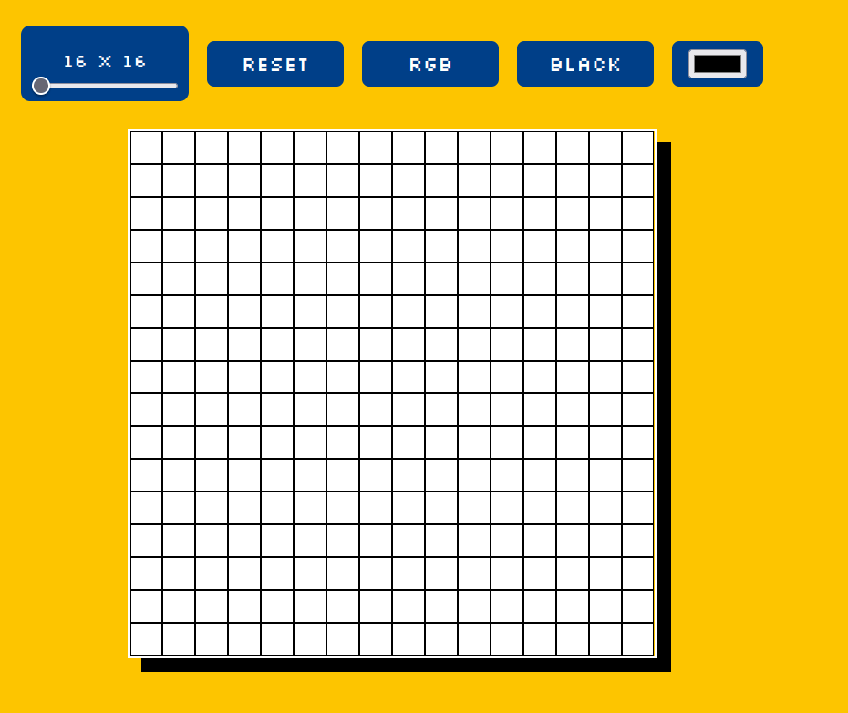
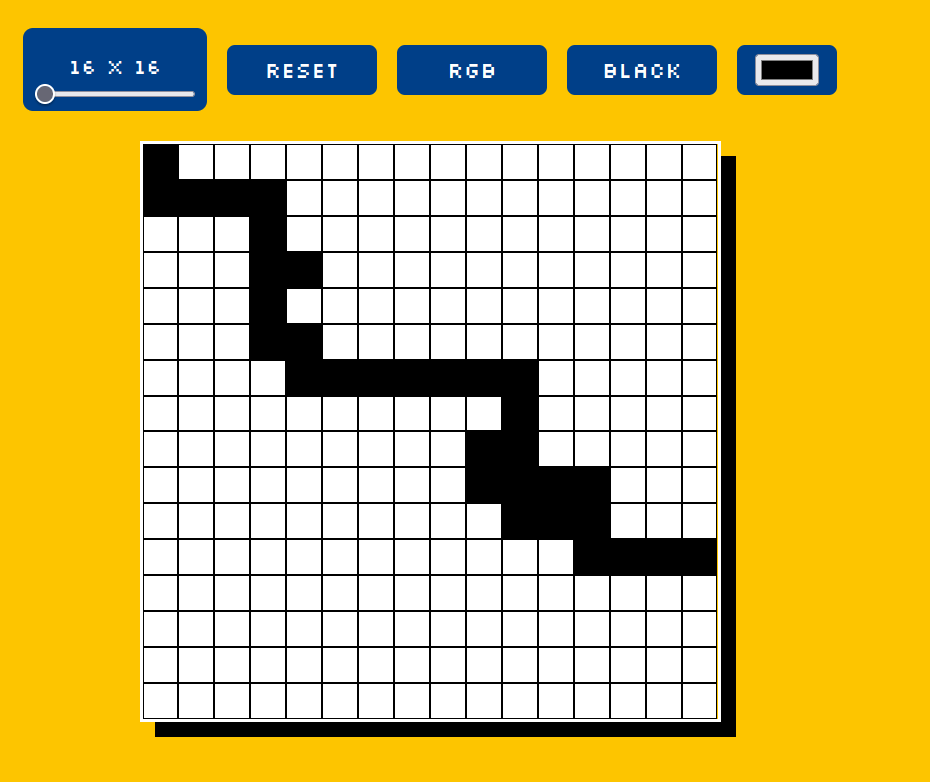
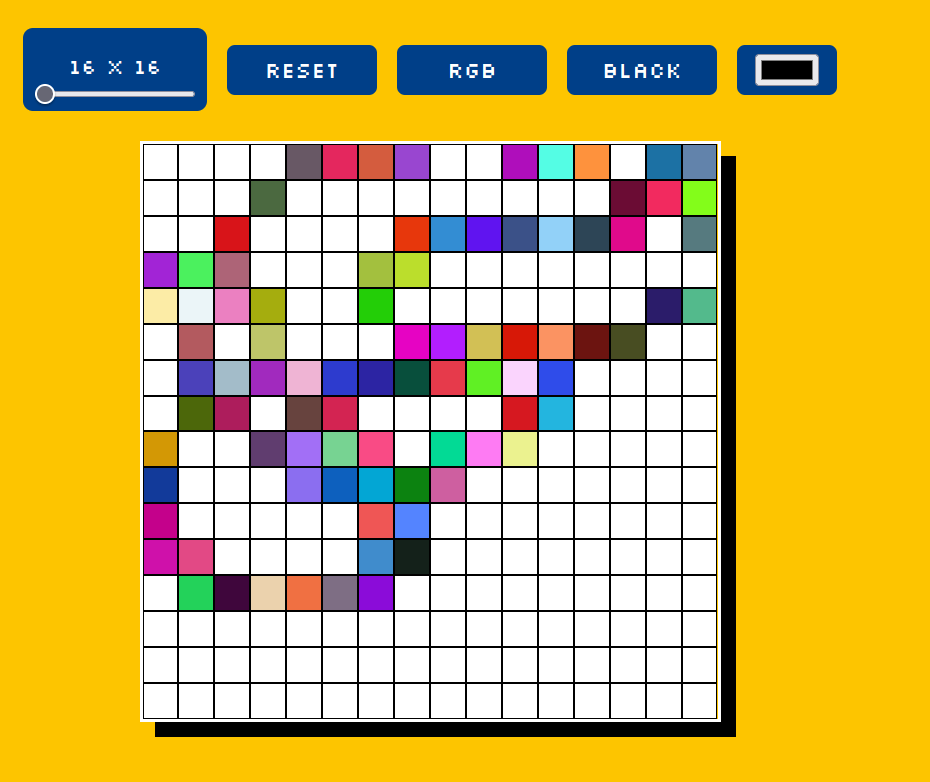

## Etch a sketch

Evitei aprender front-end e o javascript por algum tempo, agora, estou no processo de aprender javascript, html e css, por mais que não queira atuar na parte de front-end este conhecimento vai me tornar um profissional mais completo.

Este projeto é proposto no caminho de javascript no odin project, gosto de aprender com desafios pois me ajudam a fixar o conteudo.

O desenvolvimento deste projeto foi ótimo, pois me ajudou a entender melhor como funciona a manipulação de DOM com javascript.

<h1>Tela Inicial</h1>

<h1>Desenho</h1>

<h1>Rgb mode</h1>

